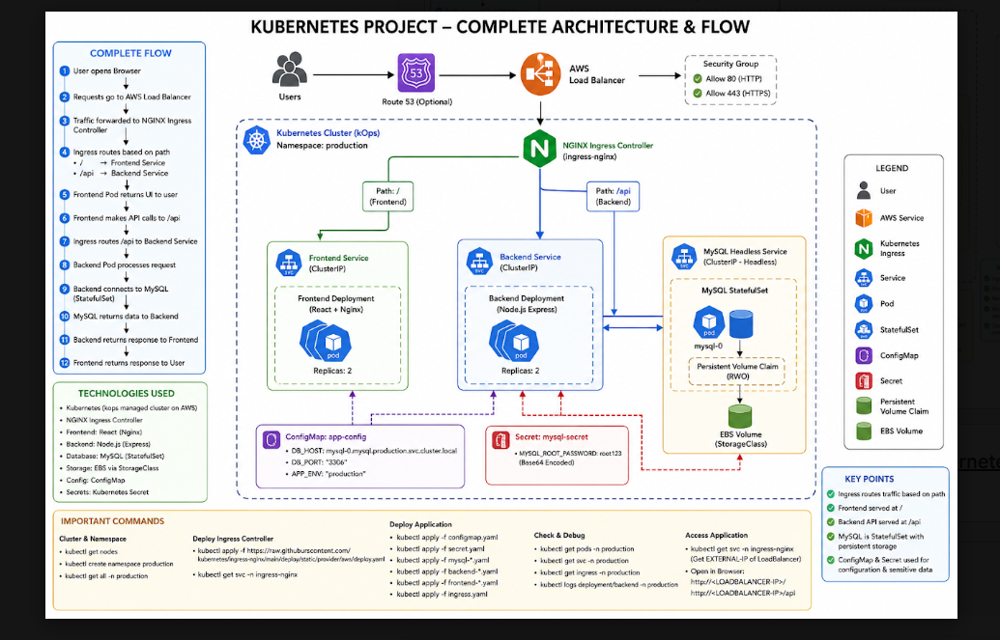
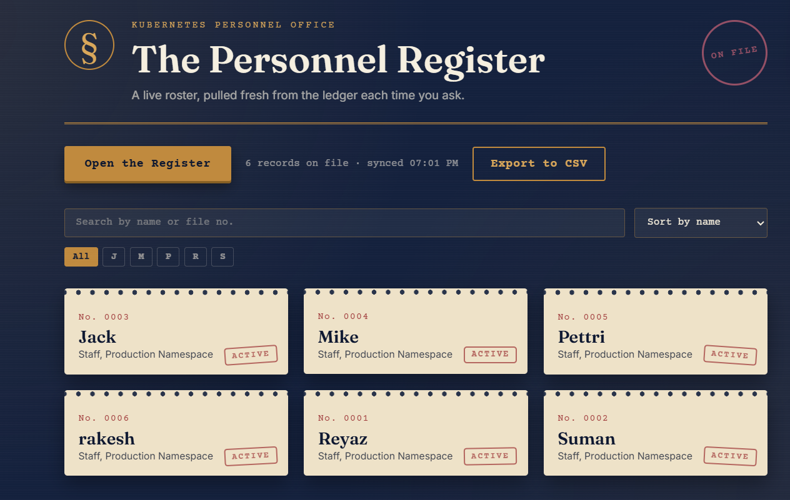

# ☸️ Kubernetes Personnel Register

## Project Overview

This project is a containerized personnel management application deployed on Kubernetes.

The application consists of a frontend, backend API, and MySQL database. Kubernetes is used to deploy, manage, scale, and expose the application using Deployments, Services, Ingress, ConfigMaps, Secrets, StatefulSet, and persistent storage.

---

## ⚙️ Architecture Flow

User → AWS Load Balancer → NGINX Ingress → Frontend Service → Frontend Pods --> Backend Service → Backend Pods → MySQL Service → MySQL Pod → Persistent Storage

---

## 🏗️ Architecture

---

## 🌐 Website

---

## 🛠️ Tools & Technologies Used

- Kubernetes
- Docker
- NGINX Ingress Controller
- MySQL 8.0
- Kubernetes Deployment
- Kubernetes StatefulSet
- Kubernetes Services
- Headless Service
- ConfigMap
- Secret
- Persistent Volume
- Persistent Volume Claim
- AWS EC2
- KOPS
- GitHub

---

## 📦 Application Components

### Frontend

- Containerized frontend application
- Deployed using Kubernetes Deployment
- Runs with 2 replicas
- Container exposed on port 80
- Exposed internally using `frontend-service`

### Backend

- Containerized backend API
- Deployed using Kubernetes Deployment
- Runs with 2 replicas
- Application runs on port 3000
- Exposed using `backend-service`

### MySQL

- MySQL 8.0 database
- Deployed using Kubernetes StatefulSet
- Uses 1 MySQL replica
- Uses persistent storage for database data
- Uses a Headless Service for stable MySQL network identity

### NGINX Ingress

NGINX Ingress receives external HTTP requests and routes them to the correct Kubernetes Service.
/       → frontend-service
/api    → backend-service

## 🎯 Outcome

- Successfully deployed a full-stack application on Kubernetes
- Implemented frontend and backend containerization
- Used Kubernetes Deployments for application workloads
- Used StatefulSet for MySQL
- Implemented persistent database storage
- Configured NGINX Ingress for external access
- Implemented Kubernetes Services for internal communication
- Used ConfigMaps and Secrets for application configuration
- Gained hands-on experience with Kubernetes and AWS

---

## 📚 Key Learnings

- Kubernetes architecture and components
- Docker containerization
- Kubernetes Deployments and Pods
- StatefulSet and persistent storage
- Services and service discovery
- Headless Services
- NGINX Ingress
- ConfigMaps and Secrets
- PersistentVolume and PersistentVolumeClaim
- Kubernetes namespaces
- Application deployment and troubleshooting
- AWS and KOPS-based Kubernetes infrastructure

---

## 👨‍💻 Author

**Sanjeevan Varma**

GitHub: [https://github.com/sanjeevanvarma](https://github.com/sanjeevanvarma)

LinkedIn: [https://www.linkedin.com/in/sanjeevan-varma-indukuri-90943529b/](https://www.linkedin.com/in/sanjeevan-varma-indukuri-90943529b/)
